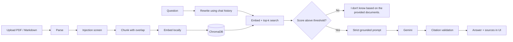

# 📖 Docent

**Ask questions about your own documents and get answers you can verify.**

Docent is a Retrieval-Augmented Generation (RAG) chatbot. You drop in PDFs or Markdown
files, ask questions in plain language, and Docent answers **only from what is in your
documents**. It cites the passages it used, shows you the source text with match scores,
and says *"I don't know based on the provided documents."* when the answer isn't there.


---

## Table of contents

- [Features](#features)
- [How it works](#how-it-works)
- [Tech stack](#tech-stack)
- [Quickstart](#quickstart)
- [Using Docent](#using-docent)
- [Configuration](#configuration)
- [Project structure](#project-structure)
- [Security and guardrails](#security-and-guardrails)
- [Evaluation](#evaluation)
- [Testing](#testing)
- [Desktop app](#desktop-app)
- [Deployment](#deployment)
- [Privacy](#privacy)
- [Troubleshooting](#troubleshooting)
- [Roadmap](#roadmap)
- [License](#license)

---

## Features

- **Grounded answers only.** The model is instructed to use the retrieved passages and
  nothing else. If nothing relevant is found, Docent refuses *without calling the LLM*.
- **Numbered citations** in every answer, validated against the passages actually
  retrieved. Invented citation numbers trigger a visible warning.
- **Transparent sources.** Each answer has an expandable source list showing the file,
  page, exact passage text, and a similarity score.
- **Drag-and-drop upload** for PDF, Markdown, and plain-text files, with multi-file support.
- **Conversation memory.** Follow-up questions like *"what about its price?"* are
  rewritten into standalone search queries so retrieval still works.
- **Prompt-injection defenses** for uploaded documents (screening, sanitization,
  data/instruction separation, no tool access).
- **Light, dark, and auto appearance**, remembered between sessions.
- **Local-first.** Documents are parsed, embedded, and stored on your machine. Only the
  question and the retrieved passages are sent to the LLM.
- **Desktop app.** Runs in its own native window, with installers for Windows, macOS,
  and Linux built by CI.
- **Built-in evaluation.** LLM-as-a-judge scoring for context relevance and faithfulness.

---

## How it works



1. **Ingestion.** Files are parsed (page-aware for PDFs), scanned for injection phrasing,
   and split into overlapping chunks (about 1000 characters with 150 overlap). Markdown is
   split on headings and code fences first. Chunk IDs are deterministic, so re-uploading
   a file is an idempotent update rather than a duplicate.
2. **Indexing.** Chunks are embedded with a local model and stored in a persistent
   ChromaDB collection using cosine similarity.
3. **Retrieval.** The question is rewritten into a standalone query, embedded, and
   matched against the index. Results below the minimum similarity are discarded.
4. **Gate.** If no chunk passes, Docent refuses immediately. This is the strongest
   anti-hallucination control, because the model never gets a chance to guess.
5. **Generation.** Surviving chunks are wrapped as untrusted data in a strict prompt
   that requires citations and an exact refusal phrase when context is insufficient.
6. **Validation.** Citations are checked against the retrieved set, and the UI shows
   exactly the passages the model saw.

---

## Tech stack

| Layer | Choice | Why |
|---|---|---|
| UI | Streamlit | Native file upload, chat, and expanders; free hosting options |
| Vector DB | ChromaDB (persistent, cosine HNSW) | Zero-cloud setup with metadata filtering and simple upserts |
| Embeddings | `BAAI/bge-small-en-v1.5` (local) | Strong quality for its size, runs on CPU, keeps text off embedding APIs |
| LLM | Google Gemini (`gemini-3.5-flash` by default) | Fast, capable, free tier available |
| Chunking | `langchain-text-splitters` | Markdown-aware recursive splitting, with no framework lock-in |
| PDF parsing | `pypdf` | Pure Python, page-aware |
| Orchestration | Plain Python | The loop is about 100 lines, so there is no framework to maintain |
| Desktop | `pywebview` + PyInstaller + Inno Setup | Native window and installers on all three platforms |

The LLM provider is isolated in `src/llm.py`, so swapping vendors means changing one file.

---

## Quickstart

### Prerequisites

- Python **3.10 or newer**
- A Gemini API key. A free one is available at <https://aistudio.google.com/apikey>
- Internet access on first run, to download the embedding model (about 130 MB)

### Install and run

```bash
git clone https://github.com/<your-username>/docent-rag.git
cd docent-rag

python3 -m venv .venv
source .venv/bin/activate            # Windows: .venv\Scripts\activate
pip install -r requirements.txt      # a few minutes: pulls in PyTorch

cp .env.example .env                 # then add your key (see below)
streamlit run app.py
```

Docent opens at <http://localhost:8501>.

### Add your API key

Either put it in `.env`:

```
GEMINI_API_KEY=AIza...your-key...
```

or skip that and start the app. If no key is found, Docent shows a welcome screen where
you can paste it. It is then stored in your per-user config folder, not in the project.

> Run it with `streamlit run app.py`, not `python app.py`. Streamlit apps need
> Streamlit's own server.

---

## Using Docent

1. **Add documents.** Drop PDF, Markdown, or text files into the **Library** sidebar.
   Wait for the "passages indexed" confirmation.
2. **Ask a question** in the chat box.
3. **Check the evidence.** Expand **sources** under any answer to see the exact passages,
   page numbers, and match scores. Superscript marks like ⁽¹⁾ in the answer correspond
   to the numbered sources.
4. **Narrow the search** with *Restrict search to* if you only want answers from certain files.
5. **Tune retrieval** under *Search settings*:
   - **Passages to retrieve**: how many chunks are considered (default 5).
   - **Minimum match**: raise it for stricter answers, lower it if Docent refuses too often.
6. **Switch appearance** between Auto, Light, and Dark in the sidebar.
7. **Remove a file** with the ✕ next to it, or **Clear chat** to start over.

---

## Configuration

### Environment variables

Set these in `.env` or your shell. All are optional except the API key.

| Variable | Default | Purpose |
|---|---|---|
| `GEMINI_API_KEY` | none | Gemini API key (or enter it in the app) |
| `LLM_MODEL` | `gemini-3.5-flash` | Model used for answers and query rewriting |
| `JUDGE_MODEL` | `gemini-3.5-flash` | Model used for evaluation scoring |
| `EMBEDDING_MODEL` | `BAAI/bge-small-en-v1.5` | Local sentence-transformers model |
| `CHROMA_DIR` | `./data/chroma` | Where the vector index is stored |

### Tunable settings (`src/config.py`)

| Setting | Default | Notes |
|---|---|---|
| `chunk_size` / `chunk_overlap` | 1000 / 150 chars | About 250 tokens per chunk, with 15% overlap |
| `min_chunk_chars` | 40 | Tiny fragments are dropped |
| `top_k` | 5 | Passages retrieved per question |
| `min_score` | 0.30 | Cosine-similarity gate. Tune it on your own corpus |
| `max_history_turns` | 4 | Turns used when rewriting follow-ups |
| `max_upload_mb` | 20 | Per-file upload limit |
| `max_answer_tokens` | 1024 | Answer length cap |
| `quarantine_suspicious_chunks` | `True` | Exclude chunks that look like prompt injection |

Model names change over time. If one is rejected, check the current list at
<https://ai.google.dev/gemini-api/docs/models> and set `LLM_MODEL`.

---

## Project structure

```
docent-rag/
├── app.py                          # Streamlit UI
├── src/
│   ├── config.py                   # Central settings
│   ├── ingestion.py                # Parse + chunk PDF/Markdown/text
│   ├── guardrails.py               # Injection scan, sanitization, citation checks
│   ├── vectorstore.py              # ChromaDB wrapper (embed, upsert, search, delete)
│   ├── llm.py                      # Gemini client wrapper
│   ├── rag.py                      # Rewrite → retrieve → gate → generate → validate
│   ├── evaluation.py               # LLM-as-a-judge metrics
│   ├── user_settings.py            # Per-user API key and appearance storage
│   └── ui_theme.py                 # Stylesheet, light/dark themes, HTML helpers
├── tests/                          # pytest suite
├── eval/golden_set.jsonl           # Your evaluation questions
├── desktop/launcher.py             # Native-window launcher
├── docent.spec                     # PyInstaller build recipe
├── installer/docent.iss            # Windows installer script (Inno Setup)
├── .github/workflows/
│   └── build-desktop.yml           # CI: build and release installers
├── .streamlit/config.toml          # Server and theme config
├── Dockerfile                      # For Hugging Face Spaces
├── requirements.txt
├── requirements-desktop.txt        # Build-only dependencies
├── pytest.ini
└── .env.example
```

---

## Security and guardrails

Uploaded documents are **untrusted input**. A malicious file can contain text such as
"ignore previous instructions". Docent layers several defenses, because no single one is
sufficient:

| Layer | What it does |
|---|---|
| **Data/instruction separation** | Retrieved text is wrapped in `<chunk>` tags, and the system prompt declares it untrusted data that must never be obeyed |
| **Delimiter hygiene** | Tags like `</context>` or `<system>` and zero-width/bidi characters are stripped, so a document can't break out of its data block |
| **Ingestion screening** | Chunks matching known injection phrasing are quarantined, and the UI reports how many |
| **No tools, no side effects** | The model cannot browse, run code, or call APIs, so a successful injection can at worst skew one answer |
| **Exfiltration controls** | The prompt forbids unquoted URLs and images, and the UI never renders document or model text as raw HTML |
| **Retrieval gate** | Irrelevant queries are refused before the model is involved |
| **Citation validation** | Citations that don't map to a retrieved passage raise a warning |
| **Limits** | Upload size cap, encrypted-PDF rejection, logging of quarantined chunks |

The pattern-based screen is a cheap first filter and can produce false positives, for
example on a document about security. That is why quarantined chunks are surfaced rather
than silently dropped.

**Before any multi-user deployment**, add authentication and a per-user filter on every
search. Otherwise one user's uploaded files are visible to everyone.

---

## Evaluation

Docent includes two reference-free LLM-as-a-judge metrics:

- **Context relevance**: what share of the retrieved passages is useful for the question.
  This diagnoses the *retriever*.
- **Faithfulness**: what share of the answer's claims is supported by the retrieved
  context. This diagnoses the *generator*.

1. Edit `eval/golden_set.jsonl`, with one JSON object per line:
```json
   {"question": "What is the refund window?", "ground_truth": "30 days"}
   {"question": "Who won the 2030 World Cup?", "ground_truth": "I don't know based on the provided documents."}
```
   Include about a quarter unanswerable questions to confirm Docent refuses them.
2. Index the documents the questions are about, then run:
```bash
   python -m src.evaluation eval/golden_set.jsonl
```
3. Read the summary:
   - Low **relevance**: tune chunk size, the minimum match, or add a reranker.
   - Low **faithfulness**: tighten the prompt or try a stronger model.
   - Unanswerable questions should show a refusal rate near 100%.

Spot-check about 20 judged outputs by hand before trusting the numbers.

---

## Testing

```bash
pytest -q
```

The suite covers guardrails, ingestion and chunking, the retrieval gate (including that
the LLM is *not* called when nothing is relevant), citation checks, settings storage,
and theme output. Tests use fakes for the vector store and LLM, so they need no API key.

---

## Desktop app

Docent also runs as a native desktop app. A local Streamlit server starts on `127.0.0.1`
(never exposed to your network) and is shown in an OS-native window via `pywebview`.

**Run it from source**
```bash
pip install -r requirements.txt -r requirements-desktop.txt
python desktop/launcher.py
```

**Build an installer locally**
```bash
pyinstaller docent.spec --noconfirm      # → dist/Docent/  (dist/Docent.app on macOS)
```
On Windows, install [Inno Setup](https://jrsoftware.org/isinfo.php) and then run
`ISCC /DAppVersion=0.1.0 installer\docent.iss`.

**Build all three with CI.** Pushing a version tag builds a Windows installer, a macOS
`.dmg`, and a Linux `.tar.gz`, and attaches them to a GitHub Release:
```bash
git tag -a v0.1.0 -m "Docent v0.1.0"
git push origin v0.1.0
```

**Where data lives** (never inside the app bundle): the index and model cache are in
your OS user-data and cache folders, the API key and appearance setting are in your OS
config folder (`settings.json`), and logs are in the OS log folder (`docent.log`).

**Notes**
- The first launch downloads the embedding model, so it needs internet once.
- Builds are **unsigned**. Windows SmartScreen and macOS Gatekeeper will warn until you
  code-sign.
- The macOS build targets Apple Silicon. Add an Intel runner to the CI matrix if needed.
- Windows needs the Edge WebView2 runtime, which current Windows 10 and 11 include.
- Installers are large because of PyTorch. Swapping `sentence-transformers` for
  `fastembed` (ONNX) in `vectorstore.py` shrinks them considerably.

---

## Deployment

### Streamlit Community Cloud (free)

1. Push the repo to GitHub. Never commit `.env`.
2. At <https://share.streamlit.io>, choose **New app**, pick the repo, and set the main
   file to `app.py`.
3. Under **Advanced settings → Secrets**, add:
```toml
   GEMINI_API_KEY = "AIza..."
```
4. Deploy. The first boot downloads the embedding model, so allow a few minutes.

### Hugging Face Spaces (Docker, free)

1. Create a new Space and choose the **Docker** SDK, then push this repo.
2. The Space's own `README.md` needs this block at the very top:
```yaml
   ---
   title: Docent
   sdk: docker
   app_port: 7860
   ---
```
3. Add `GEMINI_API_KEY` under **Settings → Variables and secrets** as a **Secret**.

### Free-tier caveats

- Disk is **ephemeral**, so the index resets when the app restarts.
- Free apps are public and share one process across visitors. Add authentication and a
  per-user filter before using real documents.

---

## Privacy

- Parsing, chunking, embedding, and the vector index all stay on your machine.
- For each question, the question text and the few retrieved passages are sent to the
  Gemini API. Nothing else leaves your computer.
- Free-tier API usage may be used by Google to improve its products. Check Google's
  current terms, and use a paid key for sensitive documents.
- Your API key is stored only in your per-user config folder or `.env`. Both are kept
  out of Git.

---

## Troubleshooting

| Problem | Fix |
|---|---|
| `ModuleNotFoundError: streamlit` | Activate the venv (`source .venv/bin/activate`) and run `pip install -r requirements.txt` |
| `streamlit: command not found` | Run `python -m streamlit run app.py` |
| `GEMINI_API_KEY is not set` | Add it to `.env`, or enter it on the welcome screen |
| "Gemini returned no text" | The reply may have been blocked by safety filters. Rephrase the question |
| Docent says "I don't know" too often | Lower **Minimum match** in the sidebar, or increase **Passages to retrieve** |
| "No extractable text" for a PDF | It is probably a scanned image. OCR is not included yet |
| Slow first question | The embedding model is downloading once (about 130 MB) |
| Port 8501 already in use | `streamlit run app.py --server.port 8502` |
| Odd colors after a Streamlit upgrade | Streamlit renames internal elements between versions. Open an issue with `pip show streamlit` |
| Desktop app won't start on Linux | Install the Qt dependencies listed in `.github/workflows/build-desktop.yml` |

---

## Roadmap

- [ ] Cross-encoder reranker (retrieve 20, rerank to 5)
- [ ] Hybrid BM25 + vector search for exact terms such as IDs and error codes
- [ ] OCR for scanned PDFs
- [ ] Streaming responses
- [ ] Authentication and per-user collections
- [ ] Code signing for desktop installers
- [ ] Conversation export

---

## License

MIT. See [LICENSE](LICENSE).

---

*Docent: a guide who knows the collection and only tells you what is on the page.*